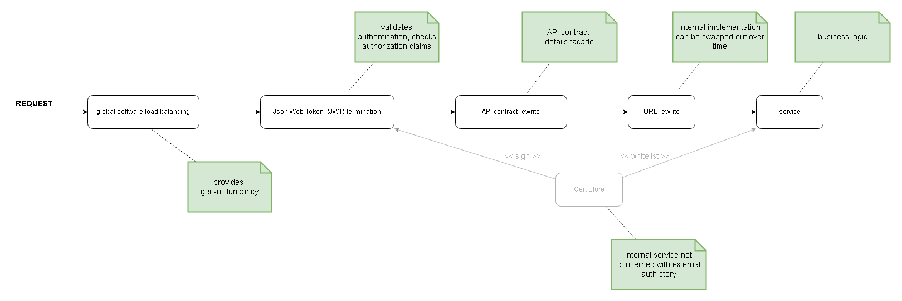

# Adding Flexibility to an API on Azure

In this write-up we'll cover usage of several Azure offerings in implementing an HTTP API, whereby the API is:

- geo-redundant for speed, availability, and safe-deployments
- throttle-able &mdash; controlling costs
- terminates a Json Web Token (JWT) on the perimeter &mdash; freeing trusted internal services from authorizations
- provides a placeholder for request and response payload rewrites &mdash; an API contract façade
- abstracts concrete service location via URL rewrites

In other words, the API is static to the outside but flexible with respect to implementation.

The intention is to think through three Azure offerings and see how they can be of help in saving us implementation time:

- Azure Front Door
- Azure API Management
- Azure Application Gateway


Consider an incoming HTTP request to serve some business need.  We want the implementation of this business logic to benefit from of all of the above value propositions; which cross-cut our API surface, without coupling to our business-logic implementation.





## What this write-up is and isn't

This is a motivational article and not a detailed step-by-step.

Although I do provide screenshots from the Azure Portal as to the relevant configurations of Azure Front Door, Azure API Management, and Azure Gateway, these are prescriptive and aren't fully elaborated on.

It's expected that the reader is familiar with Node.js and Express.js middleware.  The write-up intermingles JavaScript code examples for middleware transformations where needed.  These transformations are abstracted by HTTP calls &mdash; I serve these with Azure Functions, but that's just for simplicity and ease.

Finally, we won't detail out actual JWT transformation and we do not have any business logic.  The JWT transformation will be represented by a simple decoding using [the jwt-decode NPM library](https://www.npmjs.com/package/jwt-decode) and the final business logic will be a Web echo using https://httpbin.org/anything.  In a similar vein, we do not show usage of an internal certificate storage (key vault) between the JWT termination on the perimeter and the trusted internal service: just imagine you'd put that there.


## Our Request

```
curl -H "Authorization: Bearer your_token" http://localhost:7071/api/jwt-terminate
```


